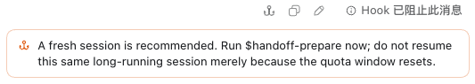

# codex-handoff

> 让一个即将到达额度边界的长任务，带着已核实的状态继续，而不是让下一位 agent 从零猜起。

`codex-handoff` 是给 Codex 用的交接插件。它不替你继续开发，也不会自动创建或切换会话；它只在恰当的时候提醒、暂停后续消耗，并帮你把已完成的工作交给下一位 agent。

## 适合什么情况？

如果你的额度一直足够完成任务，**不需要安装它**。

它适合这样的情况：一个大任务还没做完，五小时额度快用尽了。直接把聊天记录、spec 或几个文件交给新的 agent，往往会让对方重新摸索、遗漏重点或擅自扩展工作；等到下一个额度窗口，也可能继续为同一批上下文付费。

`codex-handoff` 的目标是把“交接”变成一个有边界的动作：保留目标、证据、进度、决定和下一步，而不是把一整段聊天记录塞给下一个 agent。

<p align="center">
  
</p>

## 一次开发如何被保护？

下面是一段典型的长任务经历。

### 1. 任务正常推进

额度高于 15% 时，插件保持安静。你和 Codex 像平时一样工作，不会被提醒或打断。

### 2. 剩余 15% 到高于 3%：只提醒，不停工

插件只提醒一次：现在适合准备交接。你可以忽略它并继续工作；它不会暂停 agent、不会撤销任何改动，也不会自动生成 handoff。

### 3. 剩余 3% 或以下：保留成果，再阻止继续燃烧

此时会出现两种情况：

- **你刚提交一条新请求**：这次请求会先被阻止，agent 不会开始新一轮推理或执行。你可以先运行 `$handoff-prepare`，而不是让最后一点额度消失在新的工作里。
- **agent 正在调用本地工具**：已完成的工具结果会被保留；不会撤销该工具已经做过的事，也不会丢掉它的输出。随后同一轮中下一次受支持的本地工具调用会被拒绝，避免它继续无止境地消耗额度。

这不是“清空上下文”或“丢失工作”。它只是停止**后续**动作；已经得到的工具结果、已写入的文件和当前对话都还在。

<p align="center">
  
</p>

### 4. 由你决定交接与继续

当你准备好时，运行 `$handoff-prepare`。它会在项目的 `.handoff/` 中写入一份短的 Markdown 交接检查点：先告诉你断点、哪些内容只是**已验证**、哪些已经由你**已验收**，再列出唯一主线和下一步。然后在一个新任务里运行 `$handoff-continue`：新的 agent 会先读交接单、说明它理解了什么，然后停下来等你授权下一步。

它不会把整个项目历史塞给新 agent。交接单把首次必读内容标为 **L1**，最多 3 项；背景资料标为 **L2**，默认不读，只有问题真的触发且你授权后才读取。新 agent 首轮最多提出 3 个具体澄清问题；你可以直接回答，或在原 session 仍有额度时请原 agent 写一份补遗。

<p align="center">
  
</p>

<p align="center">
  
</p>

## 会带来什么影响？

你应该预期这些行为和限制：

- **不会自动切换会话**：不会帮你新建 agent、提交代码、推送仓库或开始下一步；所有继续动作都需要你决定。
- **低额度时可能被打断一次**：五小时或周额度到 3% 时，插件会为当前会话和本次额度窗口做一次保护性阻断。阻断的目的是留住交接机会，而不是取消已完成工作。
- **不会撤销已完成操作**：已经完成的工具结果、已经写入的文件和对话上下文仍然存在。它只会拒绝同一轮的后续受支持工具调用。
- **不是百分之百的总开关**：额度保护只是**尽力而为**。托管或特殊工具路径可能绕过本地保护；如果读取额度信息失败，插件会放行，而不是误伤正常工作。
- **自动压缩仍可发生**：自动压缩前会给出强提醒，但不会强行阻止压缩。需要交接时，请主动运行 `$handoff-prepare`。

<p align="center">
  
</p>

## 三步开始使用

### 1. 安装

将公开仓库注册为 Codex marketplace，再安装插件；不需要 clone：

```bash
codex plugin marketplace add LLeung49/codex-handoff --ref main
codex plugin add codex-handoff@codex-handoff
codex plugin list
```

确认 `codex-handoff@codex-handoff` 已安装并启用后，新开一个 **Codex 任务**，让它加载新的 hook 和 skill。

#### 已经安装过旧版本？

重新安装即可更新插件：

```bash
codex plugin remove codex-handoff@codex-handoff
codex plugin add codex-handoff@codex-handoff
codex plugin list
```

如果确定不再使用它，移除插件后还可以注销 marketplace：

```bash
codex plugin marketplace remove codex-handoff
```

### 2. 正常开发，看到提醒再决定

不需要为了插件改变平时的工作方式。额度高于 15% 时它保持安静；剩余从 15% 降到高于 3% 时，收到一次提醒后，你自己决定是否立即交接。

### 3. 需要换人时，做一次明确交接

在当前任务运行 `$handoff-prepare`，检查 `.handoff/` 里生成的交接单；再在新任务运行 `$handoff-continue`。后者不会直接开始干活，只有你明确授权后才继续。

## 三个技能分别做什么？

- `$handoff-prepare`：把当前断点、目标、边界、交付/验收状态与唯一下一步写成一份不可变交接单。
- `$handoff-continue`：让新 agent 先对齐 L1，说明未读的 L2 与需要澄清之处，再等待你的授权。
- `$handoff-context-setup`：可选。它只提议创建稳定的 `agent-context.md` 背景索引；不再维护会过期的进度状态页。

## 想了解实现细节？

<details>
<summary>展开查看 hook、额度与本地文件的实现边界</summary>

五小时额度在剩余 15% 到高于 3% 时产生一次软提醒；≤3% 时产生一次保护性阻断。周额度没有软提醒，≤3% 时也会独立阻断一次。`UserPromptSubmit` 在新请求开始前检查额度；`PostToolUse` 只在一个本地工具完成后记录交接提示；`PreToolUse` 只会在同一轮已触发保护后拒绝下一次受支持的本地工具调用；`PreCompact(auto)` 只提醒，不阻断。

插件不会上传 telemetry。它只读取有限长度的本地 rollout 记录；读取失败或格式异常时 fail-open。去重和同轮保护使用的文件只存放本地状态，不保存 handoff 正文；真正的交接内容始终在项目 `.handoff/` 中。

</details>

## 本地开发

只有希望修改或验证插件时才需要 clone：

```bash
git clone https://github.com/LLeung49/codex-handoff.git
cd codex-handoff/plugins/codex-handoff
python3 -m unittest discover -s tests -v
```

完整的插件与 skill 验证命令见 [插件源码 README](plugins/codex-handoff/README.md)。
