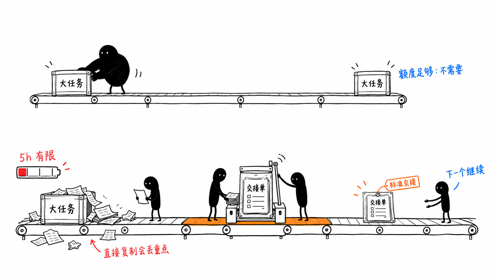
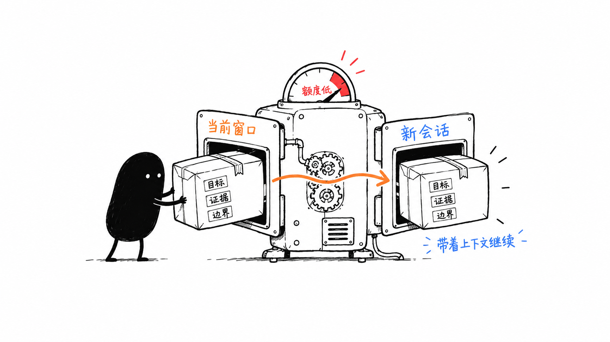
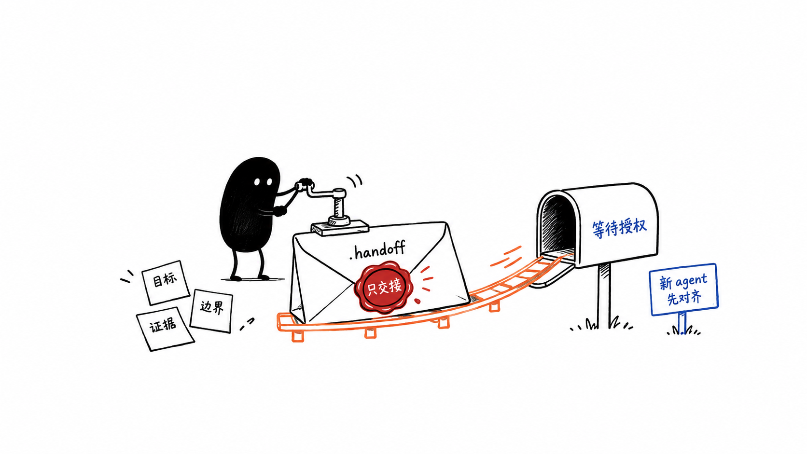
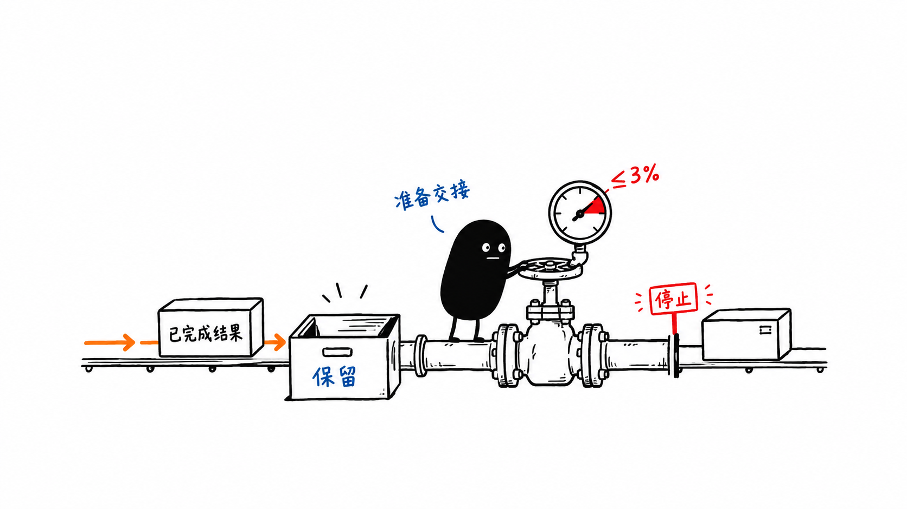

# codex-handoff

> 在长任务的上下文或额度到达边界前，保留已核实的状态，再有意识地继续工作。

`codex-handoff` 是一个 Codex 插件，适合任务仍然重要、但当前上下文或 Coding Plan 额度已不适合继续承载工作的时候。它把交接内容整理成小而可审阅的包；是否新开任务、何时继续、由谁继续，始终由**你**决定。它不会自动切换会话。

如果额度足够覆盖你的工作，大多数人不需要这个工具。它解决的是：一个长期任务尚未完成，五小时窗口却已经接近耗尽；只复制聊天记录或把 spec 交给新的 agent，传递的是原始材料，而不是有边界的共同状态。新的 agent 可能偏离目标、重复工作、遗漏重点，并在重建上下文时继续消耗额度；即使等待下一个窗口，也可能再次付出同样的上下文成本。

<p align="center">
  
</p>

## 🚀 安装

将这个公开仓库注册为 Codex marketplace，再安装插件；不需要 clone 仓库：

```bash
codex plugin marketplace add LLeung49/codex-handoff --ref main
codex plugin add codex-handoff@codex-handoff
codex plugin list
```

确认列表显示 `codex-handoff@codex-handoff` 已安装并启用，然后新开一个 **Codex 任务**。新任务才是加载新 hook 与 skill 的可靠边界。

升级或重新安装已有副本：

```bash
codex plugin remove codex-handoff@codex-handoff
codex plugin add codex-handoff@codex-handoff
codex plugin list
```

通常应保留 marketplace 注册。只有确定不再需要时，才在移除插件后执行：

```bash
codex plugin marketplace remove codex-handoff
```

## 为什么需要 codex-handoff？

| 问题 | 插件保护什么 | 仍由你决定什么 |
| --- | --- | --- |
| 长任务超过额度或上下文窗口 | 新任务开始前可捕获已核实的任务状态 | 是否、何时、在哪里继续 |
| 新 agent 缺少原始范围与决策 | handoff 关联目标、证据、相关产物与边界 | 下一步被授权的动作 |
| 额度紧张后工具循环持续扩张 | 已完成的工具结果会被保留；同一轮后续受支持的本地工具可以被停止 | 是否运行 `$handoff-prepare` |
| 新窗口原本要重新重建上下文 | 小而可审阅的快照替代无边界地重放完整聊天记录 | 是否运行 `$handoff-prepare` |

这个插件的范围刻意很窄：没有 daemon、没有 supervisor、不会自动新建任务，也不会自动切换会话。

<p align="center">
  
</p>

它传递的是已经核实的任务状态，而不是要求一个新的 agent 从零开始重建任务。

## 工作方式

```text
正常任务工作
      │
      ├─ UserPromptSubmit：在强阈值触发一次保护性 prompt 阻断
      ├─ PostToolUse：保留已完成的本地工具结果，并设置同轮 latch
      └─ PreCompact(auto)：给出强 handoff 警告
      │
      ▼
$handoff-prepare
      │  写入一份与厂商无关、位于项目内的 Markdown 快照
      ▼
新的 Codex 任务
      │
      ▼
$handoff-continue
      │  对齐上下文、范围、证据与开放决策，然后停止
      ▼
你授权下一项有范围的动作
```

上面的“带着上下文继续”图表达的正是这一点：跨过边界时带走已核实的工作，而不是把新任务当作一张白纸。

<p align="center">
  
</p>

## 技能

### 1. `$handoff-context-setup`

当项目需要长期、可复用的上下文时使用一次。它先进行只读发现，并提出下列本地文件的具体来源与内容建议：

- `docs/agent-context.md`：来源层级、约束、当前范围与阅读顺序
- `docs/project-status.md`：已交付内容、进行中事项、阻塞项与等待决策

它必须等到你明确批准后，才会创建或大幅重写这两个文件。`docs/` 是本地工作材料，不会随此开源仓库发布。

### 2. `$handoff-prepare`

当你决定保留当前任务时使用。它会写入一份不可变的 `.handoff/<UTC timestamp>-<slug>.md` 快照，记录原始目标、范围约定、所需上下文、当前状态、决策理由、证据、问题分流、Git 状态与继续工作的约定。handoff 记录事实；它不授权未来工作。

### 3. `$handoff-continue`

在新任务中使用。它读取仓库指令、可选的上下文索引、指定 handoff 以及 handoff 列出的任务产物，然后给出上下文对齐报告并停止。没有你的明确指示，它不会运行命令、编辑文件、测试、提交、推送或执行建议的下一步。

## 额度保护

| 信号 | 行为 |
| --- | --- |
| 五小时额度：剩余 25% 至高于 3% | 一次 `$handoff-prepare` 软提醒 |
| 五小时额度：剩余 3% 或以下 | 每个会话与重置窗口各一次保护性 prompt 阻断 |
| 周额度：剩余 3% 或以下 | 每个会话与重置窗口各一次独立的保护性 prompt 阻断 |
| 某个受支持的本地工具观察到任一强阈值 | 保留该结果，提供 handoff 上下文，并锁存这一轮 |
| 同一已锁存轮中的后续受支持本地工具 | `PreToolUse` 可在执行前拒绝它 |
| 自动压缩 | 强但不阻断的提醒 |

额度保护只是**尽力而为**：它无法观察每一个模型动作，托管或特殊工具路径可能绕过本地 hook。不要为了测试而耗尽额度。当日常工作自然到达 3% 或以下时，可以请求两个无害的本地命令：要么 prompt guard 在工作开始前阻断，要么第一个已完成的工具结果会被保留，第二个受支持的本地工具会被拒绝。

插件数据标记是本地、零内容的去重/latch 文件；它们不是项目的 `.handoff/` 文档，也不保存 handoff 内容。

<p align="center">
  
</p>

## 第一次检查

在新开的 Codex 任务中发送：

```text
只使用 $handoff-context-setup 检查这个仓库，并提出上下文文档来源建议。不要创建或修改文件。提出建议后停止。
```

预期结果只是建议，不会写入长期文件。如果 Codex 请求信任插件 hook，请确认它只有：

```text
python3 "$PLUGIN_ROOT/hooks/context_guard.py"
```

这个 hook 只读取有边界的本地 rollout telemetry 尾部；在数据无法读取或格式错误时会 fail-open。它不会上传 telemetry、编辑项目文件、调用 handoff skill 或切换会话。

## 本地开发

只有在你希望修改或验证插件时才需要 clone：

```bash
git clone https://github.com/LLeung49/codex-handoff.git
cd codex-handoff/plugins/codex-handoff
python3 -m unittest discover -s tests -v
```

完整的插件与 skill 验证命令见 [插件源码 README](plugins/codex-handoff/README.md)。
